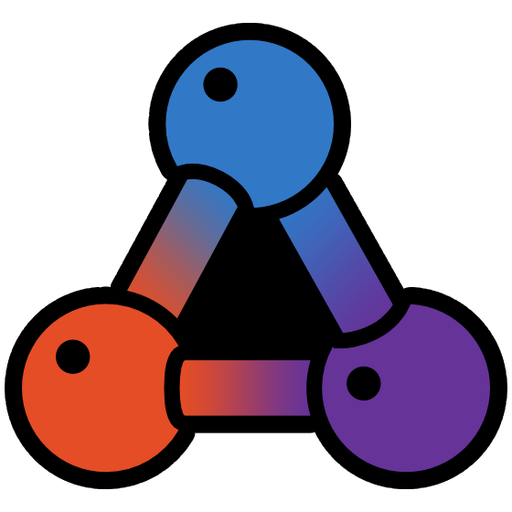

<h1 align="center">WEB Development made simple and fun again</h1>

<p align="center">
  
</p>

<h1 align="center">nuBond</h1>

<p align="center">
  <strong>A declarative TypeScript progressive framework with Web Components, Shadow DOM, and an attribute-driven binding system.</strong>
</p>

<p align="center">
  <a href="https://www.npmjs.com/package/nubond"></a>
  <a href="LICENSE"></a>
  
  
  
</p>

---

## What is nuBond?

nuBond is a lightweight UI framework for building reactive progressive web applications in TypeScript that respects vanilla web development. It pairs **Web Components and Shadow DOM** with a familiar **decorator + HTML/CSS templates** authoring model, an **attribute-based binding system**, **dependency injection**, **routing**, and **automatic change detection** — all in one cohesive package.

## Why nuBond?
- **Simple** — 15 minutes and you know all the basics, 15 minutes more and you know everything
- **No dependencies** — the framework has no release dependencies and only one dev dependency — `tslib`
- **Lightweight** — as lightweight as possible without compromising functionality
- **Fast** — blazingly fast performance at any application size
- **Feature rich** — powerful and feature rich, no compromises and no limitations
- **Portable** — can be compiled into a single JavaScript file
- **Easy migration** — can co-exist with other UI frameworks/libraries on the same page and integrate with them

## Highlights

- **Declarative templates** — `nb-value`, `nb-class`, `nb-if`, `nb-repeat`, `nb-event:click`, and more.
- **Decorator-based metadata** — `@AppRoot`, `@Container`, `@Component`, `@Aspect`, `@Transformer`, `@Injectable`.
- **Web Components first** — components are real Custom Elements with isolated Shadow DOM and scoped styles.
- **Built-in DI** — constructor injection with singleton or transient lifetimes.
- **Automatic change detection** — automatically triggered based on events and input changes, with the ability to trigger manually via injection or the `@Detector()` / `@Eventer()` decorators.
- **Routing** — hash-based or path-based routing with declarative slot binding (`nb-container="%slot"`).
- **Aspects** — reusable element-level behaviors that mix into any element without creating a new scope.
- **Transformers** — global pure functions usable from any expression (`{{ dateFormat(...) }}`).
- **Content projection** — powerful HTML template processing based on named and default slots with append-or-replace semantics.
- **Adopted styles** — share `CSSStyleSheet` instances across components.
- **W3C compliance mode** — switch from `nb-*` to `data-nb-*` attributes when strict HTML conformance is required.

## Quick Start

The fastest way to scaffold a new app is via `create nubond`:

```bash
npm create nubond blank my-app
cd my-app
npm start
```

Or add nuBond to an existing TypeScript project:

```bash
npm install nubond
```

> **Requires** TypeScript with `experimentalDecorators` and `emitDecoratorMetadata` enabled.

## Hello, world

**`src/index.ts`** — bootstrap the app with `@AppRoot`:

```typescript
import { AppRoot } from 'nubond';
import { Main } from './pages/main/main';

@AppRoot(
    { showDebugInfo: true },
    '/#[page=main]',
    Main
)
export class App { }
```

**`src/pages/main/main.ts`** — a container with HTML template:

```typescript
import html from './main.html';
import { Container } from 'nubond';

@Container(html)
export class Main {
    public name = 'world';

    public greet() {
        this.name = 'nuBond';
    }
}
```

**`src/pages/main/main.html`** — declarative binding via `nb-*` attributes:

```html
<h1>Hello, {{this.name}}</h1>
<button nb-event:click="this.greet()">Greet</button>
```

## A taste of the binding system

```html
<!-- Text & HTML -->
<p nb-value="this.user.fullName"></p>
<div nb-html="this.richContent"></div>

<!-- Classes & styles -->
<div nb-class="{active: this.isOpen; disabled: !this.canEdit}"></div>
<div nb-style="opacity: this.fade; color: this.theme.text"></div>

<!-- Conditional & iteration -->
<p nb-if="this.items.length">You have items.</p>
<li nb-repeat="this.items" nb-value="`${index + 1}. ${item.title}`"></li>

<!-- Events with optional debounce -->
<input nb-event:input:300="this.search(event)" />

<!-- Components & containers with input passing -->
<my-card nb-in:title="this.headline" nb-event:save="this.onSave(data)"></my-card>
<div nb-container="@SettingsPanel" nb-in-ref:user="this.currentUser"></div>

<!-- Route slot binding -->
<div nb-container="%page"></div>
```

## Documentation

**[`Documentation & Feature Reference`](FEATURES.md)**

In addition all features and details are available in the `showcase` app:
```bash
npm create nubond showcase showcase-app
cd showcase-app
npm start
```

## Ecosystem

nuBond ships alongside a set of satellite packages:

| Package | Purpose |
|---|---|
| **[`create-nubond`]()** | Project scaffolder — `npm create nubond`. Includes `blank`, `native`, and `showcase` templates. |
| **[`posthtml-value-interpolation`]()** | Parcel/PostHTML plugin enabling `{{ expression }}` text interpolation in templates. |
| **[`nuBond Language Service`]()** | VS Code extension: hover, completion, go-to-definition, rename, references, diagnostics, CodeLens, and a TypeScript plugin for cross-file template ↔ class navigation. |

## License

[MIT](LICENSE) © Dmytro Tomayly
